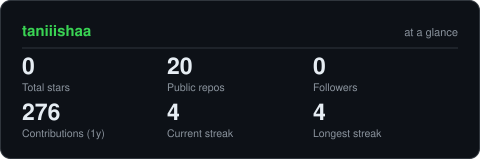

<!-- NAME / TAGLINE - animated typing -->

 

<!-- SOCIALS -->

---

# ABOUT ME

Hi, I'm **Tanisha**, an aspiring Software Engineer and Computer Science Engineering student interested in **Backend Development, AI, Data Science, and Cloud Computing**.

I enjoy building **intelligent, scalable, and data-driven applications** that solve real-world problems. My experience includes developing backend applications, working with databases, exploring machine learning solutions, and building cloud-based projects through internships, projects, and hackathons.

I work primarily with **Python, C++, SQL, FastAPI, Flask, AWS, Linux, Machine Learning, and Data Analytics**. I'm particularly interested in the intersection of **software engineering and artificial intelligence**, where automation, data, and intelligent systems come together.

Currently, I'm exploring **Agentic AI, advanced AI workflows, backend architectures, and cloud technologies** while continuously building projects and strengthening my technical skills.

## AREAS OF INTEREST

- 💻 **Backend Engineering**
- 🤖 **Artificial Intelligence & Agentic AI**
- 📊 **Data Science & Analytics**
- ☁️ **Cloud Computing**
- 🚀 **Building Real-World Projects**
 

## TECHNICAL SKILLS

---

## `~/` skill radar

<table>
<tr>
<td width="50%" align="center" valign="middle">

<!-- Self-rated radar - edit assets/skills.json, the workflow redraws it -->
<picture>
  <source media="(prefers-color-scheme: dark)"  srcset="assets/radar-dark.svg">
  <source media="(prefers-color-scheme: light)" srcset="assets/radar-light.svg">
  
</picture>

</td>
<td width="50%" align="center" valign="middle">

<!-- Live radar built from real language byte counts across your repos -->
<picture>
  <source media="(prefers-color-scheme: dark)"  srcset="assets/radar-langs-dark.svg">
  <source media="(prefers-color-scheme: light)" srcset="assets/radar-langs-light.svg">
  
</picture>

</td>
</tr>
</table>

---

## CONTRIBUTION ACTIVITY

<!-- 3D isometric calendar, regenerated every 6h by .github/workflows/metrics.yml -->

  

<!-- Snake eats the contribution graph - .github/workflows/snake.yml -->
<picture>
  <source media="(prefers-color-scheme: dark)" srcset="https://raw.githubusercontent.com/taniiishaa/taniiishaa/output/snake-dark.svg">
  <source media="(prefers-color-scheme: light)" srcset="https://raw.githubusercontent.com/taniiishaa/taniiishaa/output/snake.svg">
  
</picture>

---

## GITHUB STATISTICS

<!-- Generated by scripts/cards.py into this repo. Deliberately NOT
     github-readme-stats / streak-stats / github-profile-trophy: those are
     shared public instances that go down and take the whole section with them. -->
<picture>
  <source media="(prefers-color-scheme: dark)"  srcset="assets/card-stats-dark.svg">
  <source media="(prefers-color-scheme: light)" srcset="assets/card-stats-light.svg">
  
</picture>

 

  

---

`01110100 01101000 01100001 01101110 01101011 01110011 00100000 01100110 01101111 01110010 00100000 01110011 01100011 01110010 01101111 01101100 01101100 01101001 01101110 01100111`

